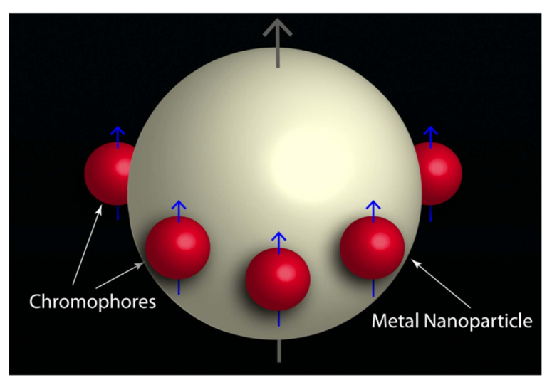

# Open Quantum Systems solver for emitters coupled to a single plasmonic cavity

## Problem Statement
- The problem of many emitters coupled to a single cavity is a hard problem in cavity quantum electrodynamics
- The problem can be simplified to roughly quintic order in cases when the emitters can be considered identical
- Here we utilise an algebraic symmetry within the equations of motion to reduce the computational complexity down to quartic, granting access to larger sized system solutions

## Results
- We used C++, odeint, boost and custom sparse matrix and vector manipulation methods to perform the required time stepping integrations
- The code is parallelised to run on supercomputing clusters using OpenMP
